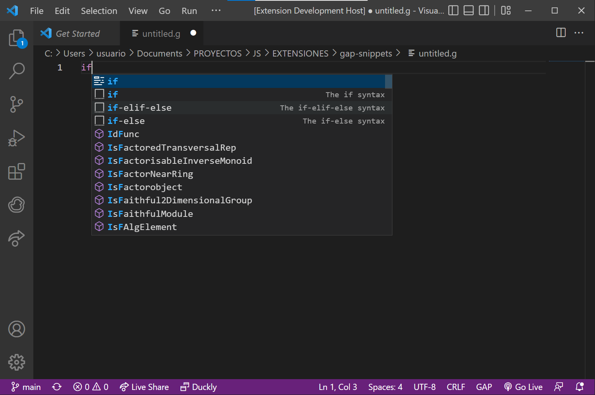

# gap-snippets

## Features

### Details

-   License: MIT
-   Version: 0.0.1
-   Extension URI: https://github.com/juniors90/gap-snippets

## Known Issues

Known issues at avaialble at the [Github Repo](https://github.com/juniors90/gap-snippets/issues)

## Release Notes

### 1.0.0

- [x] Code snippets for Print, LogTo and Read files.
- [x] The if, if-else, if-elif-else syntax.
- [x] The for and while loop syntax.
- [x] The for loop where the list in the loop body is a range.

---

**Enjoy!**
